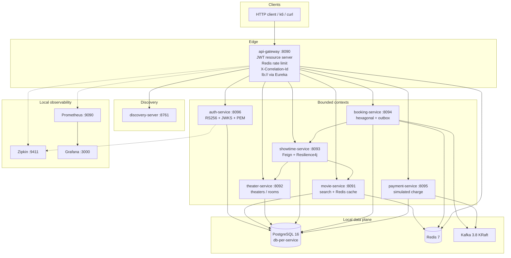
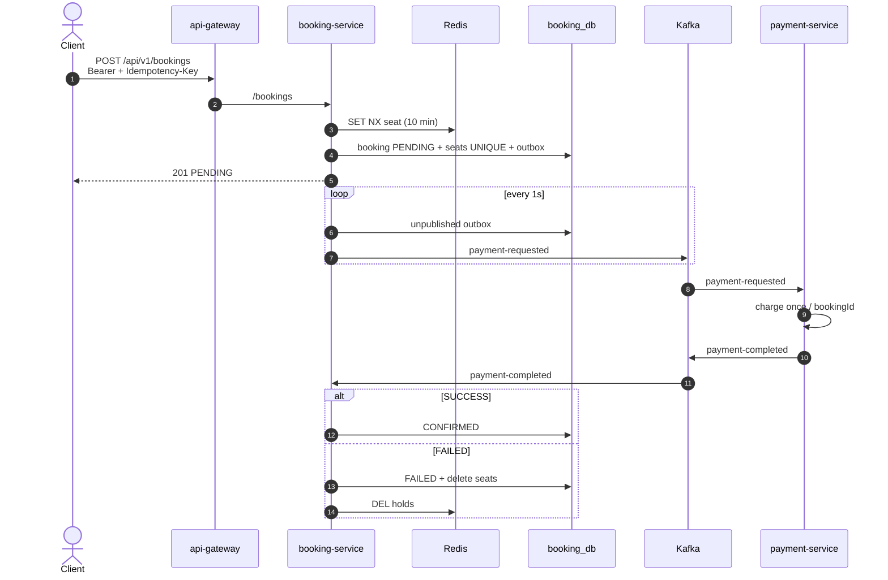

# Movie Booking Platform

[](https://github.com/longhang2004/movie-booking-microservice/actions/workflows/ci.yml)
[](https://openjdk.org/projects/jdk/17/)
[](https://spring.io/projects/spring-boot)
[](https://www.postgresql.org/)
[](https://kafka.apache.org/)
[](https://redis.io/)

> **Learning / test lab, not a production system.** This repo exists to practice Spring Cloud, JWT, hexagonal booking, transactional outbox, and local Docker. It runs **one replica** of each process, ships **demo passwords and RSA keys**, uses a **simulated card gateway**, and works around Compose DNS with `extra_hosts: host-gateway`. Do not expose it to the internet or treat CI green as production readiness. See [What this is not](#what-this-is-not).

Distributed cinema ticketing on a laptop: clients hit Spring Cloud Gateway; each service owns a PostgreSQL database; seats are held in Redis and enforced with a unique constraint; payment settles asynchronously through an outbox and Kafka.

**Docs**

| Page | Contents |
|------|----------|
| [Architecture](docs/architecture.md) | Containers, JWT/JWKS, hexagonal booking, observability |
| [Flows](docs/flows.md) | HTTP path, login, seat hold, payment saga, conflicts |
| [Testing](docs/testing.md) | Unit matrix, CI run, smoke script, k6 lab limits |

---

## Architecture



All public traffic is `/api/v1/**`. The gateway rewrites to the service path and load-balances with `lb://{spring.application.name}` (client-side; **one replica**, so unused). OpenAPI is proxied as `/{service}/v3/api-docs` **before** `/{service}/**` so Swagger UI at the gateway can aggregate definitions.

---

## Booking and payment flow



Double-booking is blocked twice: Redis `SET NX` and `UNIQUE (showtime_id, seat_number)`. Same `Idempotency-Key` returns the original booking. Details: [docs/flows.md](docs/flows.md).

---

## What this is not

| Lab choice | Production would need |
|------------|------------------------|
| One replica per service | Multiple instances, real use of `lb://` / Feign load balancing |
| Demo users `Admin@123` / `User@123` | Identity provider, secret manager, no passwords in git |
| Committed `docker/jwt/*.pem` | Rotating keys in a KMS/HSM, never in the repo |
| `SimulatedCardGateway` | Real PSP, webhooks, PCI scope |
| Compose `extra_hosts: host-gateway` | Real overlay DNS / Kubernetes Services |
| Gateway 60 req/min/IP | Tuned limits, per-user quotas, WAF |
| `k8s/base.yaml` sample | Full charts, probes, PDB, NetworkPolicy |
| H2 in unit tests | Contract/IT against Postgres + Kafka |
| Tracing sample rate `1.0` | Sampled traces, log aggregation |

Use this repo to **read the code, run Docker, break seats, and inspect Zipkin**. It is not a template to deploy as-is.

---

## Bounded contexts

| Process | Port | Persistence | Sync deps | Async |
|---------|------|-------------|-----------|--------|
| `auth-service` | 8096 | `auth_db` | — | — |
| `movie-service` | 8091 | `movie_db` + Redis cache | — | — |
| `theater-service` | 8092 | `theater_db` | — | — |
| `showtime-service` | 8093 | `showtime_db` | Feign movie + theater | — |
| `booking-service` | 8094 | `booking_db` + Redis locks | Feign showtime | `payment-requested` → `payment-completed` |
| `payment-service` | 8095 | `payment_db` | — | `payment-requested` → `payment-completed` |

Each service: Flyway, `ddl-auto: validate`, `open-in-view: false`. Databases from `docker/postgres/init.sql`.

Shared library `platform-security`: JWT decode, PEM, `X-Correlation-Id`, RFC 7807. Auth signs RS256 with a PEM-backed key (`kid=auth-service-rsa`); resource servers pull JWKS. Refresh tokens are SHA-256 hashes with family reuse detection. Five failed logins → `423` for 15 minutes.

Demo accounts (non-`test` profile):

| Email | Password | Role |
|-------|----------|------|
| `admin@cinema.local` | `Admin@123` | `ADMIN` |
| `user@cinema.local` | `User@123` | `USER` |

Catalog **writes** need `ADMIN`. Booking/payment need an authenticated user.

---

## Local run

Java 17, Docker. Compose publishes infra on the host.

```bash
cp .env.example .env
make up                  # generate keys if missing, package, compose up
# Eureka http://localhost:8761 should list seven apps
make smoke
make test                # unit tests (H2)
make load                # optional; needs k6 on the host
```

| UI | URL |
|----|-----|
| Eureka | http://localhost:8761 |
| Aggregated OpenAPI | http://localhost:8090/swagger-ui.html |
| Zipkin | http://localhost:9411 |
| Prometheus | http://localhost:9090/targets |
| Grafana | http://localhost:3000 (`admin` / `admin`) |

```bash
TOKEN=$(curl -s -X POST http://localhost:8090/api/v1/auth/login \
  -H 'Content-Type: application/json' \
  -d '{"email":"user@cinema.local","password":"User@123"}' \
  | python3 -c "import sys,json; print(json.load(sys.stdin)['accessToken'])")

curl 'http://localhost:8090/api/v1/movies?q=Inception&size=5'
curl -X POST http://localhost:8090/api/v1/bookings \
  -H "Authorization: Bearer $TOKEN" \
  -H "Idempotency-Key: demo-001" \
  -H 'Content-Type: application/json' \
  -d '{"showtimeId":1,"seats":["B1","B2"]}'
```

---

## Test results

Recorded **2026-09-20** on branch `cursor/security-rs256-jwks-fd20` (`a249a41`). Full matrix and commands: [docs/testing.md](docs/testing.md).

| Layer | Result |
|-------|--------|
| Unit tests | **46 tests, 0 failures** across `platform-security` + 8 services (`make test` equivalent) |
| GitHub Actions | [run 35489046479](https://github.com/longhang2004/movie-booking-microservice/actions/runs/35489046479) — all **Build & Test** jobs green (`platform-security`, discovery, gateway, auth, movie, theater, showtime, booking, payment). Docker image job skipped (PR, not `main`). |
| Compose smoke | `scripts/smoke-test.sh` — login, catalog, book, poll payment. Path exercised in earlier local Docker runs on this architecture (PENDING → CONFIRMED, `409` on duplicate seats, idempotent replay). |
| k6 | Lab script only (`make load`). Not a capacity number; gateway is 60 req/min/IP and there is one replica. |

H2 `test` profile: Flyway off, Eureka/Redis/Kafka disabled, in-memory seat locks. That is **not** a substitute for Postgres + Kafka in Compose.

---

## Layout

```
docs/                  architecture, flows, testing
platform-security/     JWT decoder, PEM, correlation, RFC 7807
api-gateway/           WebFlux, JWT, Redis rate limit, route + docs proxies
discovery-server/      Eureka
auth-service/          identity
movie-service/         catalog + Redis
theater-service/       theaters / rooms
showtime-service/      Feign + Resilience4j
booking-service/
  domain/              model, ports, domain exceptions
  application/         use-case + outbox relay
  adapter/             REST, Kafka, JPA, Redis, Feign
payment-service/       PaymentGateway strategy, Kafka
docker/postgres|prometheus|grafana|jwt
k8s/                   sample manifests — not a prod chart
scripts/smoke-test.sh  login → catalog → book → payment
scripts/load/booking.js  k6 browse + contended seat + saga poll
```

---

## Configuration

See `.env.example`.

| Variable | Default | Use |
|----------|---------|-----|
| `POSTGRES_USER` / `POSTGRES_PASSWORD` | `cinema` | all JDBC URLs |
| `JWT_ISSUER` / `JWT_AUDIENCE` | `movie-booking` / `movie-booking-api` | access-token `iss` / `aud` |
| `JWT_JWK_SET_URI` | `http://auth-service:8096/auth/.well-known/jwks.json` | resource-server JWKS |
| `JWT_PRIVATE_KEY_LOCATION` / `JWT_PUBLIC_KEY_LOCATION` | `/keys/private.pem` / `/keys/public.pem` | lab signing material (Compose bind-mount) |
| `REDIS_HOST` | `redis` | cache, locks, rate limit |
| `SPRING_KAFKA_BOOTSTRAP_SERVERS` | `kafka:9092` | booking + payment |
| `ZIPKIN_ENDPOINT` | `http://zipkin:9411/api/v2/spans` | traces |
| `EUREKA_CLIENT_SERVICEURL_DEFAULTZONE` | `http://eureka-server:8761/eureka/` | discovery |

Logical databases: `auth_db`, `movie_db`, `theater_db`, `showtime_db`, `booking_db`, `payment_db`.
