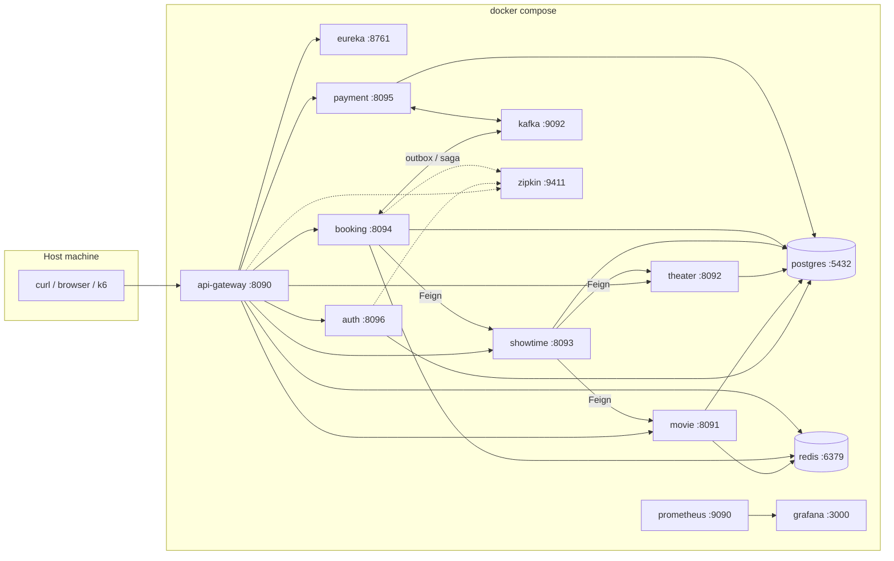
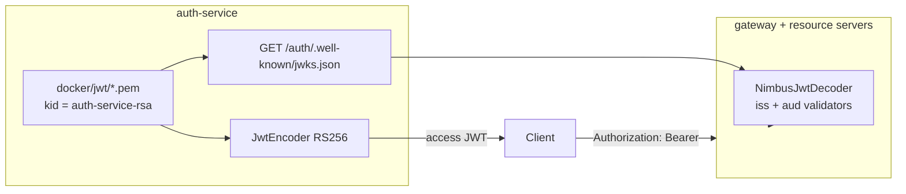
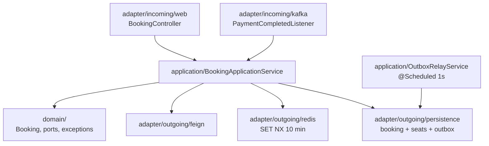
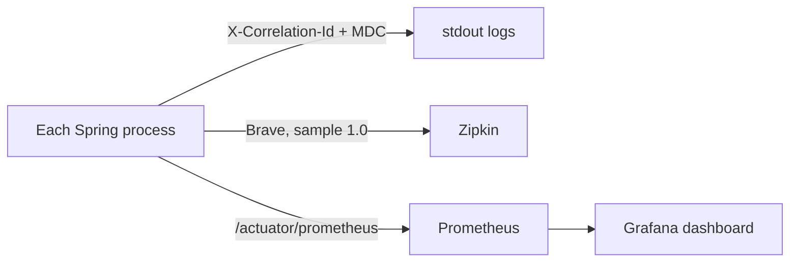

# Architecture

This document describes the **local lab** topology. One replica of each process, demo credentials, simulated payments. See the [README disclaimer](../README.md#what-this-is-not).

## Container view

Compose binds infra ports on localhost and sets `extra_hosts: *:host-gateway` so containers can reach those ports when overlay DNS is unavailable. That is a **lab workaround**, not how services should discover each other in a real cluster.

## Why each box exists

| Box | Role in the lab |
|-----|-----------------|
| api-gateway | Single HTTP entry, JWT, Redis `INCR` rate limit, `X-Correlation-Id`, `lb://` routes, Swagger aggregation |
| discovery-server | Eureka registry so `lb://movie-service` resolves |
| auth-service | Register/login/refresh, RS256 access JWT, hashed refresh, lockout, JWKS |
| movie / theater / showtime | Catalog. Showtimes call the other two over Feign + Resilience4j |
| booking-service | Hexagonal seat hold + outbox |
| payment-service | Kafka consumer, `SimulatedCardGateway`, idempotent on `bookingId` |
| platform-security | Shared jar: decoder, PEM, correlation filter, RFC 7807 |

## JWT and JWKS

- Access token claims: `iss=movie-booking`, `aud=movie-booking-api`, `sub` (email), `userId`, `roles`.
- Resource servers prefer JWKS; tests may inject `app.jwt.public-key` so they do not call auth.
- Empty PEM → ephemeral 2048-bit pair (unit tests). Compose mounts the lab files so `kid` stays stable across auth restarts.
- Refresh tokens are opaque, stored as SHA-256. Rotation revokes the previous row; a revoked token revokes the **family**.

Catalog GET is anonymous. Catalog writes require `ROLE_ADMIN`. Booking and payment require an authenticated user; booking reads are owner-or-admin.

## Hexagonal booking

`domain/` has no Spring, JPA, or Kafka types. Tests swap Redis for an in-memory `SeatLockPort`.

## Rate limit (gateway)

| Path | Limit | Redis key |
|------|-------|-----------|
| `POST .../auth/login` | 10 / min / IP | `rl:login:{ip}` |
| Other proxied HTTP | 60 / min / IP | `rl:{ip}` |
| Health, Prometheus, OpenAPI, JWKS | excluded | — |

Over limit → `429`. k6 from one machine is one IP; keep browse at ~1 rps or expect 429. See [testing.md](testing.md#k6-lab).

## Observability

Health: `/actuator/health` (show-details never on the public actuator in services). Booking health includes Resilience4j circuit breakers.

## Kubernetes sample

`k8s/base.yaml` is a **namespace + ConfigMap + Eureka Deployment** to show wiring, not a production chart (no HPA, PDB, TLS, or secrets operator).
