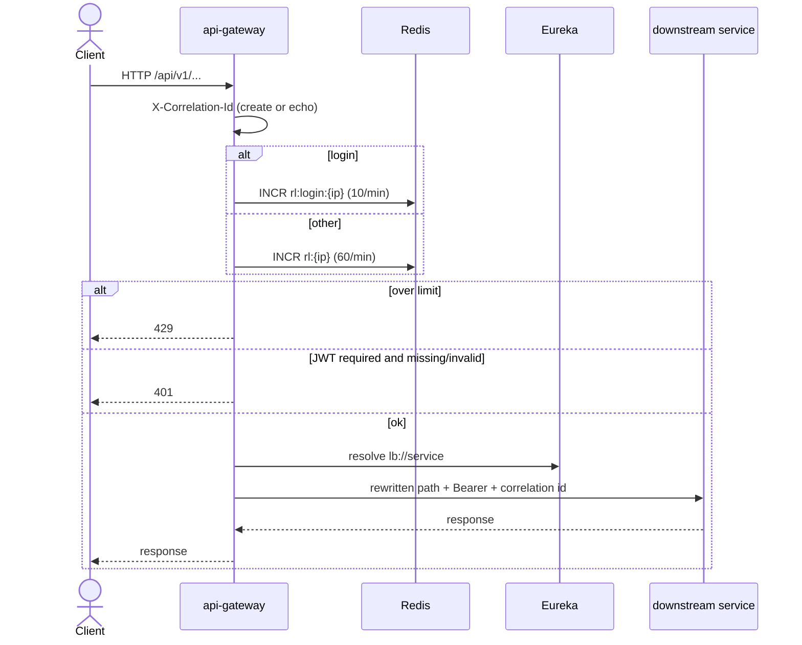
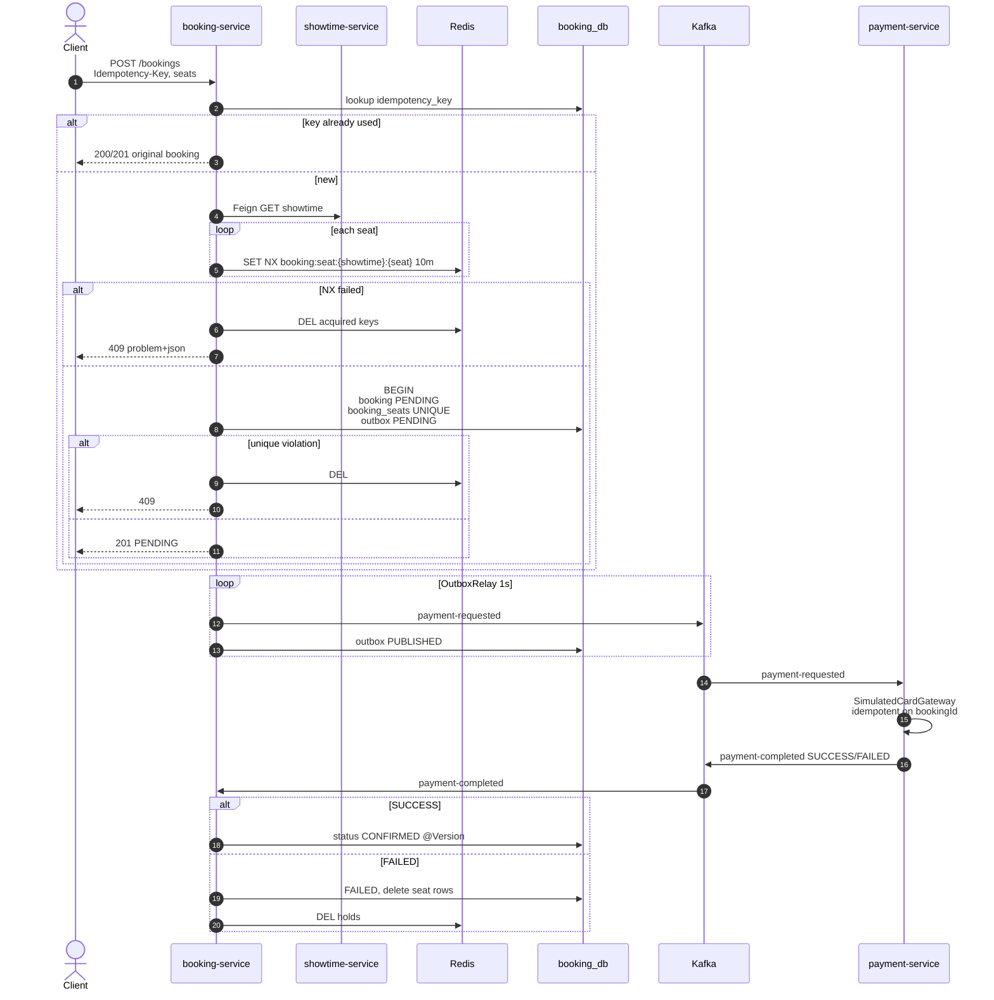
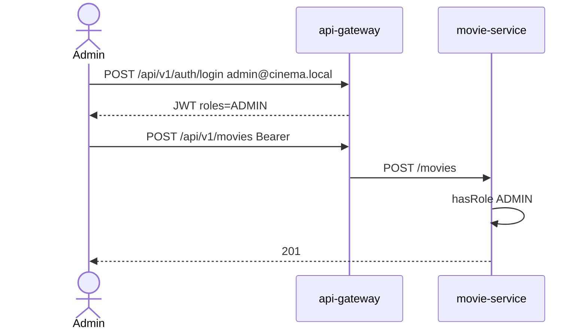
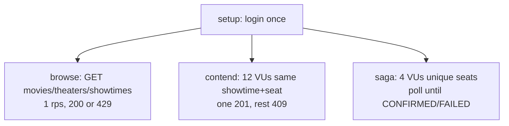

# Flows

Lab behavior only. Commands assume Compose is up on [http://localhost:8090](http://localhost:8090).

## HTTP through the gateway

Anonymous:

- `POST /api/v1/auth/register|login|refresh`
- `GET /auth/.well-known/jwks.json`
- `GET` movies, theaters, showtimes
- `/actuator/health`, `/actuator/prometheus`, Swagger

Everything else needs a valid RS256 JWT (`iss` / `aud` match).

## Login and access token

```mermaid
sequenceDiagram
  actor User
  participant GW as api-gateway
  participant AUTH as auth-service
  participant DB as auth_db

  User->>GW: POST /api/v1/auth/login
  GW->>AUTH: POST /auth/login
  AUTH->>DB: load user by email
  alt bad password
    AUTH->>DB: failedLoginAttempts++
    alt 5 failures
      AUTH->>DB: lock 15 min
      AUTH-->>User: 423 Locked
    else
      AUTH-->>User: 401
    end
  else locked
    AUTH-->>User: 423
  else ok
    AUTH->>AUTH: RS256 access JWT
    AUTH->>DB: insert SHA-256 refresh hash
    AUTH-->>User: accessToken + refreshToken
  end
```

Refresh: new access JWT + new opaque refresh; previous hash revoked. Presenting a **revoked** refresh revokes the whole family (reuse detection).

## Seat hold and payment saga

Client is **not** blocked on payment. Poll `GET /api/v1/bookings/{id}` until `CONFIRMED` or `FAILED` (smoke waits ~4s; k6 polls up to ~10s).

## Conflict responses

| Situation | Status | Type suffix |
|-----------|--------|-------------|
| Seat held in Redis or unique constraint | 409 | `conflict` |
| Missing movie/theater/booking/payment | 404 | `not-found` |
| Bean validation | 400 | `validation` |
| Account locked | 423 | `locked` |
| Bad credentials / refresh reuse | 401 | `unauthorized` |
| Gateway rate limit | 429 | — |

Bodies are RFC 7807 `application/problem+json` (`timestamp`, `path`). Shared builder: `platform-security` `ProblemDetails`.

## Catalog write (admin)

## k6 scenarios

`scripts/load/booking.js` (see [testing.md](testing.md)):

Do **not** login per VU (login limiter is 10/min). Unique `Idempotency-Key` on every booking.
