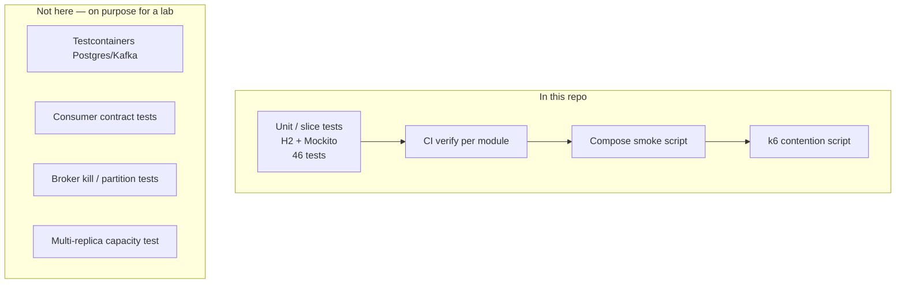

# Testing

This repo is a **learning lab**. Green tests mean the current assertions passed on H2 (and CI), not that the system is production-ready.

## How to run

```bash
make test                 # install platform-security, then ./mvnw test per service
make smoke                # Compose must already be up
make load                 # k6 on the host; Compose up
```

CI (`.github/workflows/ci.yml`): install `platform-security`, then `./mvnw verify` per module on pull requests to `main`. Docker image builds run only on `main`.

## Results (2026-09-20)

Squashed onto `main` (`f480eb6`). Unit tests and CI below ran on PR commit `a249a41` (same code as the squash, except the later docs-only commit).

### Unit tests (local)

`./auth-service/mvnw -f platform-security/pom.xml clean install` then `./mvnw test` in each service. **46 tests, 0 failures.**

| Module | Tests | What they cover |
|--------|------:|-----------------|
| `platform-security` | 14 | PEM round-trip and file load, RS256 decode, wrong `aud` rejected, correlation id echo/generate, RFC 7807 shape |
| `auth-service` | 11 | hashed refresh on register, duplicate email, lockout after 5 failures, 423 while locked, refresh reuse revokes family, RSA kid from PEM vs ephemeral, context load |
| `movie-service` | 7 | search page, get/create/update/delete, 404, context load |
| `theater-service` | 2 | `GET /theaters` includes rooms with `open-in-view=false` (MockMvc), context load |
| `showtime-service` | 1 | context load |
| `booking-service` | 6 | lock + persist + outbox, locked seats → conflict, idempotency replay, payment SUCCESS → CONFIRMED, FAILED → release seats, context load |
| `payment-service` | 3 | first charge publishes, second call for same `bookingId` is idempotent, context load |
| `api-gateway` | 1 | context load |
| `discovery-server` | 1 | context load |
| **Total** | **46** | |

H2 `test` profile: Flyway off, Eureka/Redis/Kafka autoconfig excluded, in-memory `SeatLockPort`. **Postgres, Kafka, and the gateway rate limiter are not exercised here.**

### GitHub Actions

[Run 35489046479](https://github.com/longhang2004/movie-booking-microservice/actions/runs/35489046479) (push of `a249a41`):

| Job | Conclusion |
|-----|------------|
| Build & Test (platform-security) | success |
| Build & Test (discovery-server) | success |
| Build & Test (api-gateway) | success |
| Build & Test (auth-service) | success |
| Build & Test (movie-service) | success |
| Build & Test (theater-service) | success |
| Build & Test (showtime-service) | success |
| Build & Test (booking-service) | success |
| Build & Test (payment-service) | success |
| Docker Build (matrix) | skipped (not `main`) |

### Compose smoke

`scripts/smoke-test.sh` against `http://localhost:8090`:

1. `GET /actuator/health`
2. `POST /api/v1/auth/login` as `user@cinema.local`
3. `GET` movies, theaters, showtimes
4. `POST /api/v1/bookings` seats `A1`,`A2` with a unique `Idempotency-Key`
5. Sleep 4s, `GET` booking and payment by id

Earlier local Docker runs on this architecture also checked: booking `PENDING` → `CONFIRMED`, payment `SUCCESS`, `409` on a duplicate seat, and idempotent replay of the same key. Re-run `make up && make smoke` after pulling; Compose on this agent image is not always available.

### k6 lab

Not a load-test report. `scripts/load/booking.js`:

| Scenario | Intent | Expected |
|----------|--------|----------|
| `browse` | catalog GETs at 1 rps | 200, or 429 if the 60/min/IP limiter trips |
| `contendSeat` | 12 VUs, same showtime + seat `K1`, unique idempotency keys | one 201, rest 409 |
| `bookAndPollSaga` | 4 VUs, unique seats `S{vu}` | 201 then poll to CONFIRMED/FAILED |

Login happens **once** in `setup`. Thresholds in the script (`http_req_failed < 30%`, saga p95 < 15s) are lab guards, not SLOs.

## Test pyramid (what exists vs missing)



Gaps are expected: there is no Testcontainers suite, no multi-instance load run, and catalog/showtime business logic is thinly tested compared to auth and booking.
